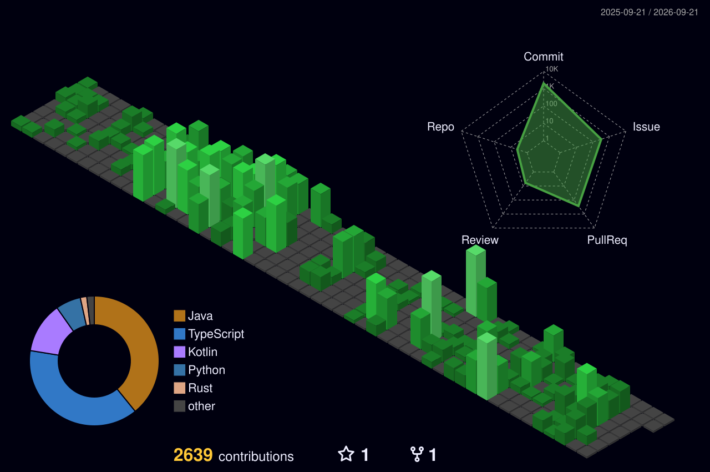

<!-- -->

### 🦕 BE Devloper
---
## Activity

- 2020.03 ~ 2026.02 : `한성대학교` 컴퓨터공학부 졸업
- 2024.03 ~ 2024.08 : `University MakeUs Challenge` - Server(Node.js)
- 2024.09 ~ 2025.02 : `University MakeUs Challenge` - Server(Spring Boot)
- 2025.09 ~ 2026.02 : `고려대학교 산학협력단 (학부인턴)` - (국가 R&D)고성능/대용량 트랜잭션 확장성 보장 기술개발 과제 
- 2026.01 ~ &nbsp; 운영 중 : `AI 복약도우미 마이약(MyYak)` - 기획, 설계, 개발, 유지보수 | [⬇️다운로드 링크⬇️](https://play.google.com/store/apps/details?id=com.myyak.app)
- 2026.04 ~ 2026.05 : `(주)Sparrow (인턴)` - 오픈소스(컴포넌트) 분석 파이프라인 개발 
- 2026.06 ~ &nbsp;&nbsp;&nbsp;&nbsp;&nbsp;&nbsp;&nbsp;&nbsp;&nbsp;&nbsp;&nbsp;&nbsp;&nbsp;&nbsp;: `한국전자기술연구원(KETI) 외주 개발` - Quic Protocol 기반 무중단 데이터 스트리밍 AI 관제시스템 PoC 개발
## Project

#### 기획 & 출시 & 운영
- MyYak [⬇️다운로드 링크⬇️](https://play.google.com/store/apps/details?id=com.myyak.app)
  - Backend(Springboot) : https://github.com/myYack-team/BackEnd-SpringBoot.git
  - Client(ReactNative) : https://github.com/myYack-team/Client-ReactNative.git

#### 동아리
- UMC
  - 📌 GrowIt Back-End (2025 서울시 일자리 박람회 참가) : https://github.com/7-umc-GrowIT/GrowIT-SpringBoot.git 📌
    - 다운로드 링크 : https://apps.apple.com/kr/app/%EA%B7%B8%EB%A1%9C%EC%9A%B0%EC%9E%87/id6752010938
  - Ne(o)rdinary Hackathon back-end : https://github.com/Ne-o-rdinary-Hackathon-7th-Team-C/team-c-api-server

#### 안암145 국가 R&D 연구과제 학부인턴(블록체인 지갑 AI 에이전트)
- 📌 AnamWallet 📌
  - AI Guide  
    - Backend(SpringBoot) : https://github.com/anam-145/anam-ai-backend.git
  - AI Agent
    - Private Repository 
#### 싱가포르 산학협력 해커톤(1등 수상)
- StockPlay
  - Client :  https://github.com/Omiljomil-five/StockPlay-FE.git
  - Backend : https://github.com/Omiljomil-five/StockPlay-BE.git
#### Cursor Hackathon Seoul vol.3
- AI 응급 의료기관 관제 시스템
  - Client : https://github.com/HSSJW/Cursor_Hack_Client.git
  - Backend : https://github.com/HSSJW/Cursor_Hack.git

#### 한성대학교
- 3-2
  - 네트워크 프로그래밍 : https://github.com/HSSJW/NetworkProgramming-MapleStory.git
  - 고급모바일 프로그래밍 : https://github.com/Damoyeo/Damoyeo.git
- 4-1
  - ios프로그래밍 : https://github.com/HSSJW/damoyeo_ios.git 
  - 캡스톤 디자인 : https://github.com/PoseSync/PoseSync-Flask.git
 
## 🏆Awards
- 7th University Makeus Challenge Demo Day - 우수상
- 2025 한성대학교 바이브코딩 경진대회 - 우수상
- 싱가포르 산학협력 해커톤 - 1등
---
<!--  -->
<!-- -->

<!--
### 📖BAEKJOON ONLINE JUDGE
  
-->
---

  

